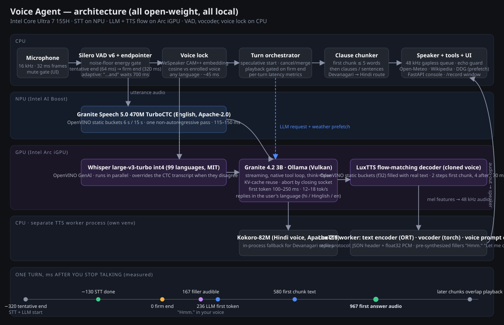

# Voice Agent — a sub-second, fully local voice assistant in your own voice, on open-weight models only

[](https://github.com/priyansh19/voice-agent/actions/workflows/ci.yml)
[](LICENSE)
[](pyproject.toml)

A real-time spoken assistant that listens, thinks, looks things up on the internet, and answers **in a clone of
your voice**, running entirely on one laptop with no cloud inference and no proprietary models. It was built and
measured on an Intel Core Ultra 7 155H (CPU + Arc iGPU + NPU, no NVIDIA GPU), splitting the models across the
three compute units so that no stage waits for another stage's hardware.



**Measured on that laptop (English, steady state, ms after you stop speaking):**

| moment | ms |
|---|---|
| transcript ready (started speculatively during your pause) | before the firm end of turn |
| first spoken reaction in your cloned voice ("Hmm.", "Right.") | ~170 |
| LLM first token | 330–550 |
| **first words of the answer audible** | **950–1200** |

Hindi / Hinglish turns take 4–6 s (multilingual STT plus Devanagari being token-expensive for the LLM).
The honest framing: sub-200 ms to a spoken reaction, about one second to the answer, everything local.

---

## Feature set

**Conversation**
- Hands-free turn taking with speculative execution: STT and LLM start on the first 64 ms of silence, ~250–320 ms
  before the turn is declared over; if you keep talking the work is cancelled and the partial transcript is merged
  into the next turn. Playback is gated on the firm end of turn, so speculation never talks over you.
- Adaptive end-of-turn: the speculative transcript decides whether a pause is a real end ("... and" waits longer).
- Cloned-voice fillers ("Hmm.", "Let me think.") pre-synthesized at startup and played within ~170 ms, only when
  the real answer is not ready yet; "Let me check that." when a tool call starts.
- Streaming everywhere: LLM tokens → clause chunker → TTS per clause → gapless playback; the first chunk is cut
  after 3 words so speech starts while the model is still writing.
- Conversation history with a per-message language tag so the model answers in the language you spoke, even
  after switching (English, Hindi in Devanagari, Hinglish in Latin letters).

**Understanding**
- English STT in ~130 ms on the Intel NPU (Granite Speech 5.0 470M TurboCTC, encoder-only, one pass).
- 99-language STT (Whisper large-v3-turbo) on the Intel GPU, used directly when the fast transcript does not look
  like English, verified in parallel when borderline, skipped when clearly English.
- Voice lock: a speaker-embedding model compares every utterance with your enrolled voice and ignores anyone else,
  in any language (your voice ~0.8 similarity, other voices < 0.3, threshold 0.45).
- Noise robustness: VAD threshold, minimum speech length, and an energy gate against the measured room noise floor;
  echo guard while the agent speaks; browser echo cancellation in hosted mode.

**Knowledge and tools** (all keyless)
- Live weather (Open-Meteo, with geocoding incl. Devanagari place names), Wikipedia summaries, DuckDuckGo search,
  clock, calculator, through the LLM's native tool calling.
- Speculative prefetch: weather questions are detected in the transcript (English, Hinglish, Hindi keywords) and
  fetched *before* the LLM runs, so the answer comes in one model round instead of three; forecasts cached 10 min.

**Voice**
- Zero-shot voice cloning from a ~20 s recording (LuxTTS, Apache-2.0), 48 kHz output, flow decoder on the GPU.
- Hindi replies spoken by a Hindi voice (Kokoro) because the clone is English-only.
- Recording window with a reading script, live level meter, take quality check (peak, clipping, silence, late
  start), playback, one-click activation and "test the clone"; silence is trimmed/condensed before enrollment.

**Operations**
- Web console: mute/unmute (Space), text test box, wav replay through the full mic path, live transcript and
  streamed reply, per-turn latency table and history, live settings (fillers, speculation, barge-in, end-of-turn
  silence, TTS steps, voice lock strictness, microphone device).
- Browser-microphone mode: the page captures your mic and plays replies itself over a WebSocket, so the console
  can be hosted anywhere (a static copy for Vercel is generated into `web/`).
- A private Ollama instance is launched with settings tuned for one low-latency conversation; nothing system-wide
  is modified.
- Everything is cached after the first start (OpenVINO compiled blobs, voice prompt encoding); warm start ~90 s.

---

## Components: what each part does and why it exists

### `agent/` — the core package

| module | what it does | why it was needed |
|---|---|---|
| `pipeline.py` | The orchestrator: owns the turn state machine, speculative start/cancel/merge, the ordered TTS slot queue, filler logic, voice-lock check, language tagging, prefetch, browser-audio attachment, voice re-recording, per-turn metrics and UI events. | Every latency trick lives in the *sequencing*, not in any single model. A turn is an object with cancel/commit events so STT, LLM, TTS and playback can overlap safely and be aborted at any point. |
| `vad.py` | Silero VAD v6 endpointer with hysteresis, pre-roll, tentative and firm end events, adaptive silence, noise-floor energy gate. | The endpoint decision is the first item on the latency budget. Emitting a *tentative* end at 64 ms of silence is what lets STT and LLM start early; the energy gate fixed "it listens too much". |
| `stt.py` | Granite Speech 5.0 TurboCTC exported to OpenVINO with static-shape buckets (6 s, 15 s) and compiled for the NPU; greedy CTC decode; serialized infer requests. | On CPU this model took 500–800 ms; on the NPU it takes 115–150 ms for any length, and the NPU is otherwise idle. Static shapes are required by the NPU; the GPU garbled long audio in fp16. |
| `stt_whisper.py` | Whisper large-v3-turbo int4 through OpenVINO GenAI on the GPU, plus an English-likeness score (wordfreq) and transcript-equality test. | The CTC model is English-only. Whisper costs ~0.9 s, so it is only in the critical path when the fast transcript looks like romanized Hindi (score < 0.7), and skipped entirely for clear English. |
| `llm.py` | Streaming chat against Ollama with the native tool loop, a fresh HTTP client per turn so a cancelled turn can be aborted by closing the socket, and warmup that primes the KV cache. | Without socket abort a cancelled request could block the next one (Ollama serializes). Warmup avoids a 2 s first-token on the first real turn. |
| `ollama_launcher.py` | Spawns a private `ollama serve` on port 11436 with `OLLAMA_NUM_PARALLEL=1`, keep-alive forever, flash attention, q8 KV cache. | The system Ollama used 4 slots; consecutive turns landed on different empty slots and re-evaluated the whole prompt (0.5–0.8 s). One slot reuses the prefix. Done without touching user settings. |
| `tools.py` | Weather (Open-Meteo + geocoding with a Devanagari city table), Wikipedia, DuckDuckGo, time, calculator; connection pre-warming; forecast cache; deliberately short JSON schemas. | The agent must reach the internet without API keys. Short schemas matter: every token of the tool schema is part of the prompt state Ollama saves/restores on each turn. |
| `prefetch.py` | Keyword rules (English, Hinglish, Hindi) that start a weather fetch from the transcript before the LLM runs and inject the result as context. | A tool call costs a full extra LLM round (~4–6 s with tool JSON generation); prefetching collapses it to one round. |
| `chunker.py` | Streaming text → speakable chunks: first chunk after 2–3 words, later chunks at clause/sentence boundaries, Devanagari danda support, markdown stripping. | TTS latency is paid per chunk, so the first chunk must be tiny and the rest must be natural clauses. |
| `tts_client.py` | TTS backends behind one interface: the LuxTTS worker (cloned voice) over a binary stdio protocol, Kokoro in-process, and a router that sends Devanagari text to the Hindi voice. | LuxTTS needs `transformers<=4.57` while the STT needs `>=5.16`, so the clone runs in a separate venv/process, which also isolates it from the main process's GIL. |
| `speaker_gate.py` | WeSpeaker CAM++ speaker embeddings on onnxruntime (kaldi fbank via torchaudio), robust enrollment over voiced windows, cosine similarity gate. | "Answer only my voice." The published sherpa-onnx wrapper crashed against the newer onnxruntime, so the model is driven directly. |
| `audio_io.py` | Microphone capture, gapless pull-based speaker with per-chunk callbacks and instant stop, a remote (browser) playback path, resampling. | Playback timing feeds the metrics ("first audio out" is measured when samples reach the device), and barge-in/echo handling needs an instant flush. |
| `metrics.py` | Per-turn timestamps and the latency table printed to the console and pushed to the UI. | You cannot optimize what you do not measure per stage; every claim in this README comes from this table. |
| `config.py` | YAML config with attribute access. | All knobs in one file (`config.yaml`), no code edits for tuning. |

### `tts_worker/` — the cloned-voice process

| file | what it does | why |
|---|---|---|
| `lux_fast.py` | LuxTTS with three fixes: the upstream CPU path's duration formula (short sentences produced zero frames), a vocoder minimum-length guard, and **static-shape buckets** for the flow decoder on the Intel GPU via OpenVINO, filled with real filler text (zero-padding broke the output) and landed exactly on a bucket by solving for the speaking-rate argument; f32 on GPU because fp16 produced NaNs. | On CPU a sentence took 3–4 s; on the GPU with static buckets it takes 300–500 ms. Dynamic shapes recompiled for ~20 s per new length, hence buckets. |
| `server.py` | The worker: loads the model, condenses the reference recording to speech-only, encodes and caches the voice prompt, compiles buckets, pre-synthesizes fillers, then serves synth requests over stdio (JSON header + float32 PCM). fd 1 is reserved for the protocol; all library output goes to stderr. | Process isolation for the dependency conflict, and a cache so restarts cost seconds, not minutes. |

### `ui/` and `web/` — the console

- `ui/server.py`: FastAPI app with a control WebSocket (events, commands, settings), the `/audio` WebSocket (16 kHz
  int16 in, 48 kHz int16 out, browser mic + playback), `/record` and `/voice.wav`, UTF-8 forced on the console
  (the Windows console crashed on Devanagari).
- `ui/index.html`: the console; `ui/record.html`: the voice-recording window.
- `web/`: static copy of the console (built by `tools/build_web.py`) for Vercel or any static host; it connects to
  whatever backend URL you enter.

### `main.py` — CLI

Live mic mode, offline wav replay, text-only turns, voice recording, device listing, `--prepare` to compile and
cache every model on first install.

### `benchmarks/`, `tests/`, `tools/`

The scripts that drove every decision above: STT on CPU vs NPU vs GPU, thread sweeps, Whisper variants, Ollama
time-to-first-token experiments (`localhost` vs `127.0.0.1`, slots, prompt length), LuxTTS backends and bucket
padding, vocoder conversion attempts, TTS quality checked by transcribing its own output, and an end-to-end test
of the browser-audio protocol.

---

## Latency engineering, in the order it mattered

1. **Hardware split**: STT → NPU, LLM + TTS flow → GPU, VAD/vocoder/voice lock → CPU. CPU-only stages were
   0.5–4 s each; after the split every stage is 100–500 ms.
2. **Speculative turn start** with cancel/merge, and playback gated on the firm end.
3. **`127.0.0.1`, not `localhost`**: on Windows the client tried IPv6 first and lost ~1.7 s per Ollama request.
4. **One Ollama slot** (private instance): prefix reuse instead of full prompt re-evaluation.
5. **Short prompts**: the runner saves/restores the slot's KV state around each changed prompt (~0.3 ms per token
   of prompt on this iGPU), so the system prompt and tool schema are kept minimal.
6. **Tiny first chunk, 2 flow steps for it, 4 for the rest**; fillers to cover the remaining gap.
7. **Whisper only when needed**, so it does not compete with the LLM for the GPU on English turns.
8. **Prefetch** for the most common tool (weather) and cached results.

Remaining floor on this laptop, and how to get to ~500 ms: the Ollama per-request state overhead (~250 ms) goes
away by running the LLM through OpenVINO GenAI with a persistent in-process KV cache; the vocoder (100–300 ms on
CPU; it does not convert to OpenVINO) needs a GPU-friendly replacement or a 1-step flow; a smaller model would
produce the first words ~100 ms sooner. On an Apple M-series or NVIDIA machine the same architecture gets there with
native Metal/CUDA paths and far less effort.

---

## Setup

Prerequisites: Windows 11 or Linux with an Intel Core Ultra (for the NPU/GPU paths; CPU fallbacks exist but are
slow), [uv](https://docs.astral.sh/uv/), [Ollama](https://ollama.com) with `ollama pull granite4.2:3b`.

```bash
uv sync                                                  # main environment
uv venv --python 3.12 tts_worker/.venv                   # isolated LuxTTS environment
uv pip install --python tts_worker/.venv -r tts_worker/requirements.txt
uv pip install --python tts_worker/.venv --reinstall-package torch --reinstall-package torchaudio --index-url https://download.pytorch.org/whl/cpu torch torchaudio
uv pip install --python tts_worker/.venv openvino
```

Model files: Granite STT and LuxTTS download from Hugging Face on first use; Kokoro files go in
`models/kokoro/` (`kokoro-v1.0.onnx`, `voices-v1.0.bin` from the kokoro-onnx releases); the speaker model
`wespeaker_en_voxceleb_CAM++.onnx` goes in `models/speaker/` (sherpa-onnx releases); Whisper downloads from the
`OpenVINO` Hugging Face org. First start compiles everything (~5 min), later starts take ~90 s.

Run:

```bash
uv run python ui/server.py       # console at http://127.0.0.1:8765
uv run python main.py            # terminal mode
uv run python main.py --wav samples/test_utterance_16k.wav --no-audio-out   # offline check
```

First conversation: **Record my voice…** (read the script, aim for "good take", *Use this voice*), enable
**Voice lock**, unmute (Space), talk.

---

## Hosting

- **Vercel / static hosts** can serve only the page (`web/`). The models need a real machine: run `ui/server.py`
  there, expose it with `cloudflared tunnel --url http://127.0.0.1:8765`, enter that URL in the page's *backend*
  field and tick *Use THIS browser's microphone*. Put Cloudflare Access in front: it speaks in your voice.
- **CPU-only VPS (2 vCPU / 8 GB)**: 10–30 s per turn with this stack; a trimmed variant (whisper-tiny, 0.5B LLM,
  Kokoro, no cloning) reaches 3–6 s. Not recommended.
- **Mac mini M4 24 GB**: a good fit (unified memory, Metal, `device='mps'` in LuxTTS); expect ~600–800 ms to the
  answer after porting the Intel-specific STT/TTS backends.
- **NVIDIA GPU box**: every model has native CUDA paths; sub-500 ms is realistic.

---

## Configuration (`config.yaml`)

| section | key knobs |
|---|---|
| `vad` | `threshold`, `min_rms_ratio` (noise gate), `min_silence_ms` (280), `min_silence_uncertain_ms`, `speculative`, `barge_in` |
| `stt` | `device` (NPU/GPU/CPU), `buckets_frames`; `multilingual.enabled/model/device/english_threshold/skip_check_above` |
| `llm` | `host` (private instance on 11436), `private_instance`, `model`, `num_ctx`, `num_predict`, `system_prompt`, `default_location`, `prefetch_wait_s` |
| `chunker` | `first_chunk_min_words`, `first_chunk_max_words`, `min_words`, `max_chars` |
| `tts` | `voice_ref`, `prompt_duration_s`, `steps`, `first_chunk_steps`, `buckets`, `threads`, `fillers.*`, `kokoro.hindi_voice`, `hindi_fallback` |
| `speaker_gate` | `enabled`, `threshold`, `model` |

---

## Repository layout

```
agent/          core package (pipeline, VAD, STT x2, LLM, tools, prefetch, chunker, TTS client, voice lock, audio I/O, metrics)
tts_worker/     LuxTTS worker process + its isolated environment (server.py, lux_fast.py, requirements.txt)
ui/             FastAPI console server, console page, voice-recording page
web/            static hosted copy of the console (generated)
benchmarks/     stt/, llm/, tts/ — the experiments behind every decision
tests/          end-to-end test of the browser-audio WebSocket path
tools/          build_web.py
docs/           architecture.svg
samples/        synthetic test utterances
voices/         your reference recording (git-ignored)
models/         downloaded weights and compiled caches (git-ignored)
main.py, config.yaml, pyproject.toml
```

## Testing and CI

```bash
uv run pytest tests/unit -q      # ~1 min, no GPU/NPU/mic: models are replaced by fakes with known latencies
uv run pytest -m speed -rA       # the pipeline's own overhead must stay < 250 ms on top of the model latencies
uv run ruff check .
```

| suite | covers |
|---|---|
| `tests/unit/test_chunker.py` | first-chunk cut, sentence/clause boundaries, decimals, Devanagari, markdown |
| `tests/unit/test_language_and_prefetch.py` | English-likeness score, transcript equality, weather prefetch rules in three languages |
| `tests/unit/test_tools.py` | weather text and caching with mocked HTTP, Devanagari geocoding, calculator sandbox, schema size |
| `tests/unit/test_vad_audio_metrics.py` | Silero endpointer on a real utterance and on noise, adaptive silence, speaker queue, remote playback, metrics |
| `tests/unit/test_pipeline.py` | turn flow, speculative start, cancel + merge, fillers, voice lock, language tags, multilingual override, tool filler, latency budget |
| `tests/unit/test_ui_server.py` | console pages, control WebSocket, `/audio` PCM streaming end to end |
| `tests/e2e/` | the same `/audio` protocol against a running server with real models |

GitHub Actions: `ci.yml` (lint, Ubuntu + Windows test matrix, latency budget, hosted-page freshness),
`tts-worker.yml` (the isolated LuxTTS environment resolves and imports; weekly), `benchmark.yml` (real end-to-end
latency on a self-hosted runner with the hardware, on demand, uploads the per-turn tables and reply audio).

## Contributing

See [CONTRIBUTING.md](CONTRIBUTING.md) (dev setup, test layers, how to add an STT/LLM/TTS backend, "bring numbers"
rule for latency PRs), [SECURITY.md](SECURITY.md) (responsible use of voice cloning) and the issue templates,
including a **latency report** template to grow the hardware table. Licensed under Apache-2.0.

## Models and licenses

| model | role | license |
|---|---|---|
| Silero VAD v6 | voice activity | MIT |
| Granite Speech 5.0 470M TurboCTC | English STT | Apache-2.0 |
| Whisper large-v3-turbo (OpenVINO int4) | multilingual STT | MIT |
| Granite 4.2 3B | LLM | Apache-2.0 |
| LuxTTS / ZipVoice-distill + LinaCodec | cloned-voice TTS | Apache-2.0 |
| Kokoro-82M | Hindi voice / fallback | Apache-2.0 |
| WeSpeaker CAM++ | voice lock | Apache-2.0 |
